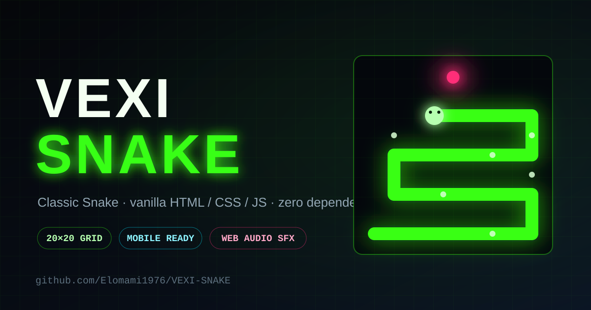

# 🐍 VEXI SNAKE



A neon-themed Snake game built in **vanilla HTML / CSS / JavaScript** — no frameworks, no bundler, no dependencies. Runs entirely in the browser and is fully playable on **desktop and mobile**.

## ✨ Features

- **Classic 20×20 grid** gameplay with responsive, HiDPI-aware canvas rendering
- **Mobile-first UI**: on-screen D-pad, tap-anywhere-to-play, swipe gestures (20px threshold)
- **Pause & mute chips** right on the HUD
- **Speed curve**: starts at 230 ms/step, shaves 7 ms per food eaten, capped at 75 ms
- **Input queue** (max 2 buffered moves) so quick turns never cause accidental self-reversal
- **Zero-asset sound engine**: all SFX synthesized live with the Web Audio API
  - Eat-sound pitch rises with your streak (`520 Hz × 1.03^streak`, capped at 24)
- **Persistent high score** via `localStorage` key `snake_best`
- Mute preference persisted via `localStorage` key `snake_muted`

## 🎮 Controls

| Action | Desktop | Mobile |
|---|---|---|
| Move | Arrow keys / WASD | D-pad or swipe |
| Pause / Resume | `P` or PAUSE chip | PAUSE chip |
| Start | Any key or click | Tap anywhere |
| Mute | SOUND chip | SOUND chip |

## 🚀 Run it

Any static file server works. For example:

```bash
npx serve .
```

Then open [http://localhost:3000](http://localhost:3000).

(Windows users can also double-click `start-server.bat`.)

> Note: `sound.js` must load **before** `game.js` — this is already handled in `index.html`.

## 📁 Project structure

```
├── index.html      # Markup: canvas, D-pad, HUD chips, overlay
├── style.css       # Neon dark theme, mobile-first layout
├── game.js         # Game loop, input queue, collision, scoring
├── sound.js        # Web Audio synth SFX (no audio files)
└── start-server.bat# Windows helper to serve the folder
```

## 🛠 Tech notes

- No build step — edit files and refresh the browser.
- Canvas resolution adapts to device pixel ratio for crisp rendering on retina screens.
- Layout respects safe-area insets for notched phones.
- Zooming and scrolling are disabled during play.

---

Built with Vexi 🤖 · Pushed to GitHub: [Elomami1976/VEXI-SNAKE](https://github.com/Elomami1976/VEXI-SNAKE)
